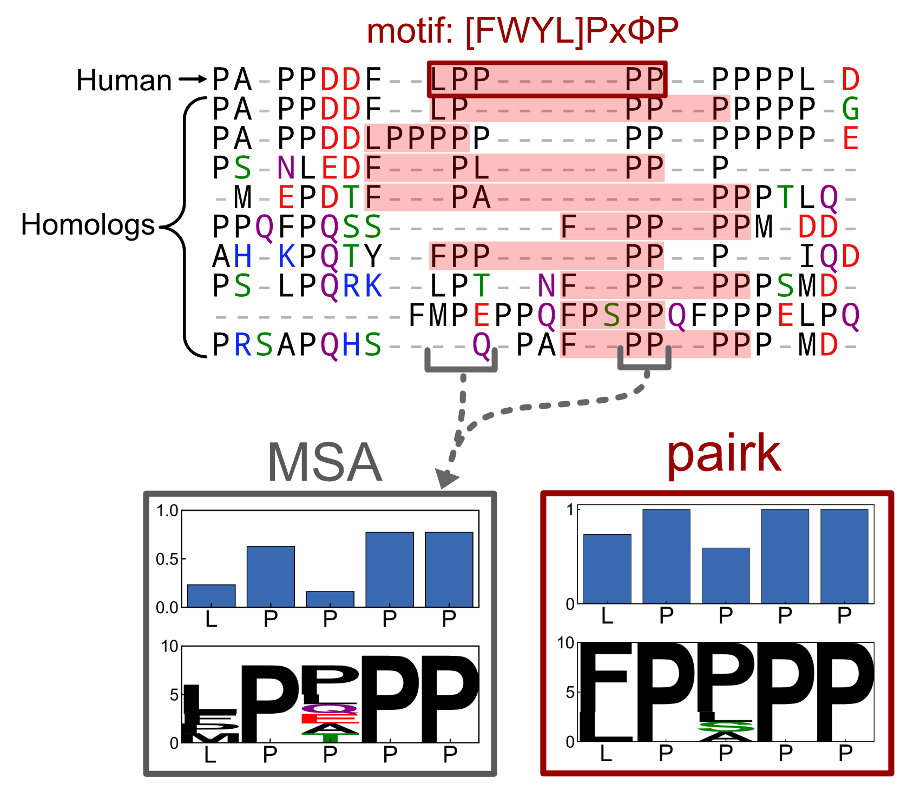

pairk
==============================
[//]: # (Badges)
[](https://github.com/jacksonh1/pairk/actions?query=workflow%3ACI)
<!-- [](https://codecov.io/gh/REPLACE_WITH_OWNER_ACCOUNT/pairk/branch/main) -->


motif conservation in IDRs through pairwise k-mer alignment

This work was supported by the National Institutes of Health under Award Number R35GM149227. The content is solely the responsibility of the authors and does not necessarily represent the official views of the National Institutes of Health.

[repository link](https://github.com/jacksonh1/pairk)

### Features
Quantify the relative conservation of a small sequence motif in intrinsically disordered regions (IDRs) of proteins, without the need for a multiple sequence alignment (MSA).


The pairk method:


Example - PairK vs MSA conservation:
<p align="center">
  
</p>


<!-- See the demo/tutorial jupyter notebook here: [demo/pairk_tutorial.ipynb](demo/pairk_tutorial.ipynb) -->
See the demo/tutorial jupyter notebook here: [demo/pairk_tutorial.ipynb](https://github.com/jacksonh1/pairk/blob/main/demo/pairk_tutorial.ipynb)

<!--  -->

### Installation
<!-- not yet published to pypi -->

<!-- #### Current recommended installation: -->
<!-- to ensure that you have the correct dependencies (specically the correct version of biopython), -->
<!-- we recommend installing in a conda environment with the provided environment.yml file with the following commands: -->
<!-- ```bash -->
<!-- git clone https://github.com/jacksonh1/pairk.git -->
<!-- cd pairk -->
<!-- conda env create -f=environment.yml -->
<!-- ``` -->
<!-- Then activate the environment with: -->
<!-- ```bash -->
<!-- conda activate pairk -->
<!-- ``` -->
<!-- then install pairk with: -->
<!-- ```bash -->
<!-- pip install . -->
<!-- ``` -->
<!-- or for an editable install that you can modify: -->
<!-- ```bash -->
<!-- pip install -e . -->
<!-- ``` -->

<!-- pip install pairk@git+git://github.com/jacksonh1/pairk.git -->

<!-- #### very near future installation instructions (after publication to pypi): -->

```bash
pip install pairk
```
or for an editable install that you can modify:
```bash
git clone https://github.com/jacksonh1/pairk.git
cd pairk
pip install -e .
```

#### virtual environment installation:

We suggest using a virtual environment to install pairk, such as conda or venv. 
You can create a new environment and just install pairk as above, or you can 
use the provided environment.yml file to create a new environment with the 
necessary dependencies like so:
```bash
git clone https://github.com/jacksonh1/pairk.git
cd pairk
conda env create -f=environment.yaml
```
Then activate the environment with:
```bash
conda activate pairk
```
and install pairk with either:
```bash
pip install .
```
or for an editable install that you can modify:
```bash
pip install -e .
```


### Documentation
see the [pairk documentation](https://pairk.readthedocs.io/en/latest/).

Also see our jupyter notebook tutorial in the `demo` folder.


### Copyright
Copyright (c) 2024, Jackson Halpin


#### Acknowledgements
 
Project based on the 
[Computational Molecular Science Python Cookiecutter](https://github.com/molssi/cookiecutter-cms) version 1.1.


#### references

- ESM2 (the model used to generate the embeddings): 
    - Z. Lin, H. Akin, R. Rao, B. Hie, Z. Zhu, W. Lu, N. Smetanin, R. Verkuil, O. Kabeli, Y. Shmueli, A. Dos Santos Costa, M. Fazel-Zarandi, T. Sercu, S. Candido, A. Rives, Evolutionary-scale prediction of atomic-level protein structure with a language model. Science 379, 1123–1130 (2023).
- Some of the ESM model sequence encoding functions are adapted from the kibby tool ([link](https://github.com/esbgkannan/kibby)): 
    - W. Yeung, Z. Zhou, S. Li, N. Kannan, Alignment-free estimation of sequence conservation for identifying functional sites using protein sequence embeddings. Brief Bioinform 24 (2023)
- Pairk's built-in conservation scoring functions are adapted from code released with this study: 
    - J. A. Capra, M. Singh, Predicting functionally important residues from sequence conservation. Bioinformatics 23, 1875–1882 (2007)
- Pairk's built-in scoring matrix "EDSSMat50" is from this study: 
    - R. Trivedi, H. A. Nagarajaram, Amino acid substitution scoring matrices specific to intrinsically disordered regions in proteins. Sci Rep 9, 16380 (2019)
- Pairk's built-in "grantham" matrices (including "grantham", "grantham_similarity_norm", and "grantham_similarity_normx100_aligner_compatible") are from or derived from the distance matrix in this study: 
    - R. Grantham, Amino acid difference formula to help explain protein evolution. Science 185, 862–864 (1974).
- blosum62 matrix is from biopython:
    - P. J. A. Cock, T. Antao, J. T. Chang, B. A. Chapman, C. J. Cox, A. Dalke, I. Friedberg, T. Hamelryck, F. Kauff, B. Wilczynski, M. J. L. de Hoon, Biopython: freely available Python tools for computational molecular biology and bioinformatics. Bioinformatics 25, 1422–1423 (2009).
    - S. Henikoff, J. G. Henikoff, Amino acid substitution matrices from protein blocks. Proc Natl Acad Sci U S A 89, 10915–10919 (1992).


