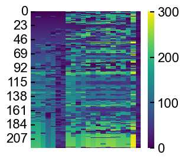
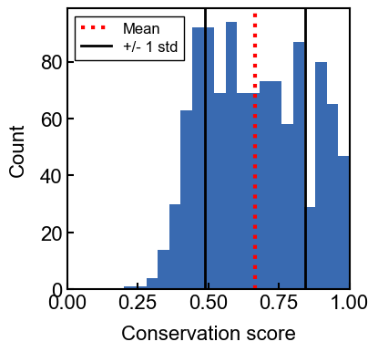
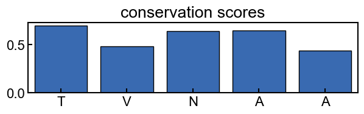
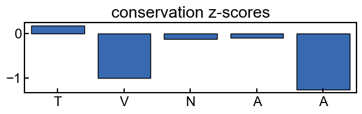
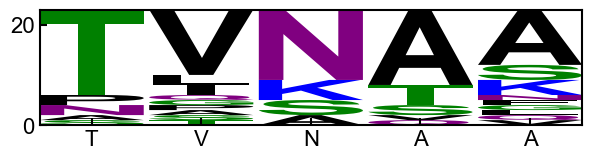
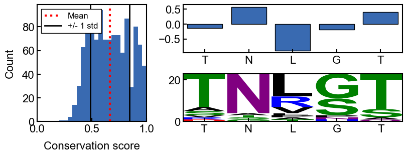
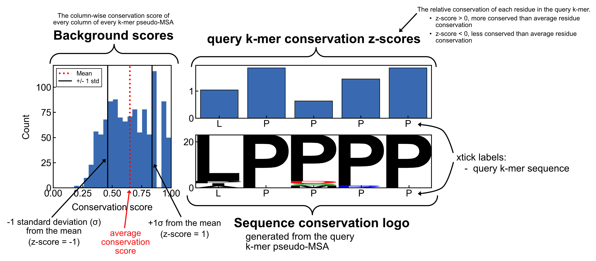

================
Pairk - tutorial
================

************
introduction
************

Pairk is a Python package for quantifying the conservation of motifs
within intrinsically disordered regions (IDRs). It will run on any input
protein sequences that you provide but it is designed for disordered
regions, where multiple sequence alignments are particularly difficult
to interpret and unreliable

the pairk method can be split into 2 steps, where each step has
configurable options:

**Step 1: pairwise k-mer alignment** - aligns all of the k-mers in the
query sequence to all of the k-mers in the homolog sequences. For each
query k-mer, the best matching k-mer from each homolog is selected and
recorded. The results are returned in a ``PairkAln`` object which
provides methods for accessing the results and writing/reading the
results to/from files. - The way in which the best matching query k-mer
- homolog k-mer match is selected is adjustable. The currently
implemented methods use either scoring matrices to score the match or
use residue embedding distances from the ESM2 protein language model to
score the match. Both methods are described in detail below

**Step 2: k-mer conservation** - calculates conservation scores for each
query k-mer using the results of Step 1. The conservation score results
are stored in a ``PairkConservation`` object which also provides methods
for plotting the results as well as writing/reading the results to/from
files. - The function used to score the conservation is adjustable.

make sure that pairk is installed before running this notebook (see the
README.md file for installation instructions)

************
import
************

Most of the functionality of pairk is accessed through the main pairk
module, which can be imported directly.

.. code:: ipython3

    import pairk

************************
load example data
************************

pairk comes with some example data that we can use to test the methods.
The example data is stored in the ``pairk.example1`` object.

.. code:: ipython3

    ex1 = pairk.example1

This example is imported as a python object and holds data that is
compatible with the main pairk methods

for example, we can access the IDR sequences in a dictionary with
``ex1.idr_dict`` or the query id with ``ex1.query_id``

.. code:: ipython3

    for id, seq in ex1.idr_dict.items():
        print(id, seq)

.. parsed-literal::

    9606_0:00294e TNLGTVNAAAPAQPSTGPKTGTTQPNGQIPQATHSVSAVLQEAQRHAETSKDKKPALGNHHDPAVPRAPHAPKSSLPPPPPVRRSSDTSGSPATPLKAKGTGGGGLPAPPDDFLPPPPPPPPLDDPELPPPPPDFMEPPPDFVPPPPPSYAGIAGSELPPPPPPPPAPAPAPVPDSARPPPAVAKRPPVPPKRQENPGHPGGAGGGEQDFMSDLMKALQKKRGNVS
    9793_0:005123 TNVGTGNAATPAPPSTGLKTGTAQANGQIPQAAHSVSTVLNEADRQVDTPKDKKPALSNHDPGTPRAQHLPKSSLPPPPPVRRSSDTSSSPVMPAKGAAGGLPPLLDDSLPPPPPPPPLEDDELPPPPPDFDDAPPNFVPPPPPWDAGASLPPPPPPPPPALALAPEATKPSPVVAKRPPVPPKRQENPAPASGGGGGEQDFMSDLMKALQKKRGNVA
    1706337_0:000fc7 TNLGTVNAAPPAPSSTGVKTGTTQANGQIPQAAHSMSTVLGEAQRQVETTKDKKSGLGSHDPGAPRAQTLPKSSLPPPPPVRRSSEVGCGSPGTSPKVKGAAAGFPAPPHDLLPPPPPPPPLEDDELPPPPPDFSDAPPDFVPPPPPPSFAGDAGSSLPPPPPPPALAPEAAKPTPVVVKRPPAPPKRQANPGPPGGGGGEQDFMSDLMKALQKKRSNMP
    51337_0:001b5a TNLGTVNTATPAQPSTGFKTGSSQPNGQIPQTIPSVSAGLQEAQRHETIKDKKPSLSSTEPGAPRDPPGARSSLPPPPPPVRRSSDTCARAASPFPAPPDDLPPPPPPPPLEDPAMLPPPPALPEPPPDCVPPPPPPPGPGPQPARPSPGAGRRPPVPPKRQENPGLPSAGAGGEQDFMSDLMKALQKRGHMP
    9568_0:004ae1 TNLGTVNAAAPAQPSTGPINGTAQPNGQMPQAAHSVSAVLQEAQRHAETSKVKPARPINGTAQPNGQMPQAAHSVSAVLQEAQRHAETSKRPSPAVAKRPPMPPKRHENPGTPSGAGGGEQDFMSDLMKALQKKRGNVS
    43346_0:004190 TNLGTVNAVPPAPPSTGVKTGTTQANGQLPQATQSMNTALGEDWRQLETTKDKKPGPGLGSHDPGAPRAQPLPKSSLPPPPPPVRRSSDVGGAPPPSFAEDLPPPPPPPPALAPESVRTPPVVVKRPPPPPKRQENPGPPGGGGGEQDFMSDLMKALQKKRGNVS
    885580_0:00488c TNLGTVNTAAAAQPPAGLRTGTSQPNGQLPRDAPCLSDALRESQRQADTSKVGPEGQGGHELPDRPKAAFQASTALAASPYSPKH
    10181_0:00305d TNLGTVSTATAAQPPTGLRTSTTQHNGQLPQAAPHLSAVLQEAQRQAEASKVGPEGNRPKLQQISAPSPPSKPEAVFWHLLLFPASENPPYCNFT
    1415580_0:000900 PNLSKVDPTVTARSSSSGAVQANGQIHQNVIPVISTNPEAFKRAEDKKPNVGRKPDQAQLQPVPSSNHQQSPKVALHASKIPPPAPARISSQAYSSALTLPSNVKNVNANVLLPPPPSPSPPPPDAFPLPPPCNNDLPPPPDDFYDPPPDFLPPPPPCFATGDRAQLPPGPPLPPPPPSSNQPKPFMKKPVPLPPKRQDITSLHSEQPSLAGPTPVGGGGGQPDFMSDLMKALQKKRGSTS
    61221_0:00105a AKSGNTESIVAVGTSAKGSTHANGQVPQSITLSKTDSSETGKSAEMPKVKKPDNTADSIQAPTPNTPQLKHQRKAGGSHSAPPMPPQRVSSAVTAPLQLPTNAEGKGKVCPSDAAEFPPPPESMLPPPELEDLPLPPPPPPEYFESPPDFIPPPPPSCAVAVSAGAPPLPPPPPSASLPRMPLSIKKKPPPPPRRQEESAGQAGLPKPSAPPPKTETAGQGDFMSDLMKALEKKRGATS
    7897_0:0033c5 ANFAKVQSQNTTASSTGSVQANGHAGQVTPVSVSFSEAWKRGDVGKEKQSNDGQDNLPPPPPPPPPPMQGFMNEAFPPPPSLPPIASGSLPPPLRASASAPAPPPISNNFPPPLDELSPPPDDFDFPEPPPDFLPPPPTVSASGVPPPPPPPPPPPAPTAASQPTPLPKKSVPPRRQENTTLSQPRGGGGGGQPDFMSDLTKALQKKRGNAS
    8407_0:002bff SSLSSSTTPTGAPQGNGQISQNVANVSSSFSDAWKRGETAKDKQQPTEVRKPEQKISLPPSTKQPPPAPVRRPSNAHVVGTPPLPIKAKPVTSNMPPPPPPAEASQWGDDFLPPPPPPELLDTPPNFLPPPPPSFNSESDYPAPPQFTNVGSAGGPPPPPPPPPPPPAALSPKSAPPQLPVKKLPPKPPMRRDSTGQRPNQQNSLMTNGGGAGGQPDFMSDLMSALQKKRSTTT
    173247_0:004550 MNRSTPSSSNPSTPSPTIKAKTPNQANGHAPKPQPTAPDSMDFGNFPPPPSADILPPPPPDPAFPPPPPSLPAKSSSRPVAPQHKLPANFPPPPMAMDNLPPPPLPPPIDDSPEAPPDFLPPPPPAAGFGSLPPPPLSMNSLPPPPHFGGMDQSLPPPPPDPEFLPPPPPEPVFTGAGAPPPPPPPPPPPPAQAAAVPRAPVRPSGSVRKVPPAPPKRTTPSLQVGGGGGGGDFMSELMVAMQKKRGDH
    30732_0:0046dd TNRSTPSSSNPSTPSPTVKAKAQSQANGHAPKPQPGPVSQDFGHLPPPPPPCPNDDLPPPPPDPVFPPPPPPLAAKRSPKTAGRSQHPQGNFPPPPPEMDHLPPPPPMEESPPDFLPPPPPMNSLPHPPPPPASFGGVDHSLPPPPPDPEFLPPPPPDPQVTGGGGPPPPPPPPPPPPPASAPAPRGALRPTGSAKKMPPAPPKRTTPVMGGGGGGGGGGGGDFMSELMKAMQKKRSDQ
    241271_0:0048e4 TNRTPVSSNQSTPSPTIKAKSPNQANGHAAKPQPGPESQDFGNIPPPPPPPPPPMTGFLPPPPPDPVLPPPPPLLAAKSPKPSPPQRNLPTNFPPPAMDNLPPPPPPPMDDSFEDPPDFLPPPPPAAGFGSLPPPPPPVNSFPPPPPSAGFGGMGQSLPPPPPDPGFLPPPPPQPMFTGGGTIPPPPPPPPPPTAAPRAPVRPTGSVKKAPPAPPKRTTPSLHGGGGGGGGGGGDFMSELMMAMNKKRGTT
    8103_0:0045e4 TNRSTPSSSNPSTPSPPIKAKSPGQANGHALKPEPGPVAQDFGHVPPPPPADILPPPADILPPPPPQTFLPPPPPPLAAKSSSKPSLPQRHLPTNFPPPPPAMINLPRPPQPPPTDDASEAPPDFLPPPPPAAGFSPLFPPPPPLNALPLPPPPVSFRVEDRSLPPPPPDPGFLPPPPPMFTGAGAPPPPPPPPPPPRVAVRPAGSVKKRPPAVPKRTTPSLRGGGGGDFMSELALAMNKKRSAH
    56723_0:00152f TNRSTPSSSSSSTPSPTIKAKSPSQANGHAPKPQPGPVSQDFGNVPPPPPPMANILPPPRPDAFLPPAPPPLARKNSAKPPPPQRHLPTNFPPPPPAMDNLPPPPPPPPMDDALEAPPDFLPPPPPAAGFGSLPPPPPPSNSFPPPPPPGSFGSMGQSLPPPPPDPGFLPPPPPQPVFTGAGAPPPPPPPPPPPTAAAAPRAPVRPSGSVKKIPPATPKRTTPSLQGGGGGGGGGGGGGGDFMSELMLAMNKKRST
    210632_0:004c0c ANRSTSSSSNSSTPSPTIKAKSSSQANGIFPKPGPAPQDFGDLPPPPPLAANILPPPPPEPGLPPPPPPPPPQAAKGSAKPAPPKRQMPANFPPPPTAMDNLPPPPPPPPIDNSEAPPDFLPPPPPASGFGSFPPPPPLNSLPPPPRPGGFGGMDQSLPPPPPDPEFLPPPPPPPQAVFTGGGAPPPPPPPPPPPAAAAPSTAIPRVGLRPAGSLKKLPPAPPKRTTPSMQGSGGGGGGDFMSELMLAMQKKRGDHP
    31033_0:00264e TNCSKPSSDGPPTPPTTIKASPANGHVPKPPPGAAPQDVFPPPPPPMDILPPPPPDPAFPPPPPPLMAKRSPKPSAGHRQAPGDHLPPPPLAPPHDDASEDPPDFLPPPPPSFDSLPPPPPGMSAFPPPPPLLGFSETSQPLPPPPPDPELLLPPPPASMISTGAGAPPPPPPPPPAAAASPRPAPTASGSVRKRPPAPPKRTTPALHGSGGGAGEGAGGGDFMSELMKAMNKKRADHS
    63155_0:004c86 TNRSTPSSSNQSTPSPTVKAKSPNQANGHPPKPQPGPISQAPFPPPPLAEVLPPPPPDPVLPPPPPMPAKSSAKPSPPKRQQQSNFPPPPPELDNLPPPPPPPPTDDTAEAPPDFLPPPPPAVGFGSLPPPPPSFGGVGQSLPPPPPDPQSLPPPPPDPVFIGAGAPPPPPPPPPPPAPGAPVTTLRPAVRPSGSLKKVPPAPPQRNTPSVSGGGGGGGGDFMSELMLAMQKKRGAQ
    7994_0:004d71 TSMNRQPSPSTSNTSTPSPTPKAKTANGHASQPRSETVPKAPSNQSAFPPPPPPADFLPPPPPDPTLPPPPPPPPALPVKKESNPPRSAPQRSQPAFPPPPPAMDFSLPPPPPPSDDLEMPPDFLPPPPPAPGGFMGGDLLPPPPPEPFHAPLPPPPAAFHPPPAVHPPPQATGGDLPPPPPPPPPPPPAPAAFHQTPSVRKVGPPPPKRTTPSLAAPSGGDFMSELMLAMNKKRGGQ
    109280_0:00369f ASCSVTSGQKQSQSQVANGHANNTSPSPLPPPPPPLGEDLPPPPPPPPQLGKTLPPAPPPLGATLPTPPPPPGGTPPPPPPPRRNPPPYPRHLPHISELYPLRRLLLLYQLPTVHSLVLLFQPNLPPNPSPNHDVQRPISRCLPGPQITFPPPPPPPVDDSPPDFLPPPPPAANFGSHPPPPPPVKTLPPPPPHMKTLPPARLSFKSTNLPPPPPDPGFLPPPLTGVPPPPPPPPPPPPTTAAAGPRRAPVRPSGSLKKMPPPPPKRSTPSLHGRRDGDRGDGDGGGGGDFMSELMRAMQKKRDPH
    150288_0:004e5a HPPDRCSTSSDNLNSQIGQSAPTPDECIEQDEPPPDFIPPPPPGYMAIL

.. code:: ipython3

    print(ex1.query_id)

.. parsed-literal::

    9606_0:00294e

********************************
Step 1: pairwise k-mer alignment
********************************

there are 2 main ways to run the k-mer alignment step:

-  **Scoring matrix alignment**

   -  These methods use a scoring matrix to score the query k-mer to
      homolog k-mer matches and select the best scoring match from each
      homolog.

-  **Embedding distance alignment**

   -  This method uses the Euclidean distance between the query k-mer
      residue embeddings from a protein large language model (such as
      ESM2) and homolog k-mer residue embeddings and selects the lowest
      distance match from each homolog.

We will only go through one of the scoring matrix alignment methods in this tutorial. They are all described in detail in :ref:`PairK alignment - in depth <k-mer-alignment-in-depth>`

k-mer alignment - :func:`pairk.pairk_alignment`
============================================================
an exhaustive comparison of all k-mers in the query sequence with all k-mers in the homologs. Uses a scoring matrix to score the query k-mer to homolog k-mer matches and select the best scoring match from each homolog.

The :func:`pairk.pairk_alignment` function takes the following arguments:

-  ``idr_dict``: a dictionary of IDR sequences, where the keys are the
   sequence ids and the values are the sequences. Includes the query
   sequence (the sequence to split into k-mers and align with the
   homologs).
-  ``query_id``: a query sequence id (the sequence to split into k-mers
   and align with the homologs). This id should be present in
   ``idr_dict``.
-  ``k``: the length of the k-mers

These inputs are provided by the user. There are helper functions
in the pairk library that might help with this (see functions in
``pairk.utilities``).

.. code:: ipython3

    aln_results = pairk.pairk_alignment(
        idr_dict=ex1.idr_dict,
        query_id=ex1.query_id,
        k=5,
    )

To specify the scoring matrix used, you can pass the name of the matrix
to the ``matrix_name`` argument.

To see the available matrices, use the
:func:`pairk.print_available_matrices()` function.

.. code:: ipython3

    pairk.print_available_matrices()

.. parsed-literal::

    biopython-builtin matrices (aligner compatible):
    BENNER22
    BENNER6
    BENNER74
    BLASTN
    BLASTP
    BLOSUM45
    BLOSUM50
    BLOSUM62
    BLOSUM80
    BLOSUM90
    DAYHOFF
    FENG
    GENETIC
    GONNET1992
    HOXD70
    JOHNSON
    JONES
    LEVIN
    MCLACHLAN
    MDM78
    MEGABLAST
    NUC.4.4
    PAM250
    PAM30
    PAM70
    RAO
    RISLER
    SCHNEIDER
    STR
    TRANS
    
    other matrices:
    grantham_similarity_normx100_aligner_compatible
    BLOSUM62
    EDSSMat50
    grantham
    grantham_similarity_norm

k-mer alignment results - :class:`pairk.PairkAln`
===============================================================

The results of all of the pairwise k-mer alignment methods are returned
as a :class:`pairk.PairkAln` object.

The actual “alignments” are stored as matrices in the :class:`pairk.PairkAln`
object. The main matrices are:

-  ``orthokmer_matrix`` - the best matching k-mers from each homolog for
   each query k-mer
-  ``position_matrix`` - the positions of the best matching k-mers in the
   homologs
-  ``score_matrix`` - the scores of the best matching k-mers

Each matrix is a pandas DataFrame where the index is the start position
of the k-mer in the query sequence. The columns are the query k-mers +
the homolog sequence ids.

The :class:`pairk.PairkAln` object has some useful methods for accessing the data.
For example, you can get the best matching k-mers for a query k-mer by
its position in the query sequence using the :func:`pairk.get_pseudo_alignment`
method (or by directly accessing the dataframes). You can also plot the
matrices as heatmaps, save the results to a json file, and load the
results from that file

example: accessing the DataFrames from the :class:`pairk.PairkAln` object directly

.. code:: ipython3

    aln_results.score_matrix

.. raw:: html

    

      
      <table border="1" class="dataframe">
        <thead>
          <tr style="text-align: right;">
            <th></th>
            <th>query_kmer</th>
            <th>9793_0:005123</th>
            <th>1706337_0:000fc7</th>
            <th>51337_0:001b5a</th>
            <th>9568_0:004ae1</th>
            <th>43346_0:004190</th>
            <th>885580_0:00488c</th>
            <th>10181_0:00305d</th>
            <th>1415580_0:000900</th>
            <th>61221_0:00105a</th>
            <th>...</th>
            <th>30732_0:0046dd</th>
            <th>241271_0:0048e4</th>
            <th>8103_0:0045e4</th>
            <th>56723_0:00152f</th>
            <th>210632_0:004c0c</th>
            <th>31033_0:00264e</th>
            <th>63155_0:004c86</th>
            <th>7994_0:004d71</th>
            <th>109280_0:00369f</th>
            <th>150288_0:004e5a</th>
          </tr>
        </thead>
        <tbody>
          <tr>
            <th>0</th>
            <td>TNLGT</td>
            <td>22.0</td>
            <td>28.0</td>
            <td>28.0</td>
            <td>28.0</td>
            <td>28.0</td>
            <td>28.0</td>
            <td>28.0</td>
            <td>10.0</td>
            <td>9.0</td>
            <td>...</td>
            <td>13.0</td>
            <td>12.0</td>
            <td>13.0</td>
            <td>13.0</td>
            <td>9.0</td>
            <td>8.0</td>
            <td>13.0</td>
            <td>8.0</td>
            <td>14.0</td>
            <td>9.0</td>
          </tr>
          <tr>
            <th>1</th>
            <td>NLGTV</td>
            <td>16.0</td>
            <td>29.0</td>
            <td>29.0</td>
            <td>29.0</td>
            <td>29.0</td>
            <td>29.0</td>
            <td>29.0</td>
            <td>16.0</td>
            <td>8.0</td>
            <td>...</td>
            <td>11.0</td>
            <td>13.0</td>
            <td>11.0</td>
            <td>13.0</td>
            <td>7.0</td>
            <td>7.0</td>
            <td>11.0</td>
            <td>6.0</td>
            <td>14.0</td>
            <td>10.0</td>
          </tr>
          <tr>
            <th>2</th>
            <td>LGTVN</td>
            <td>16.0</td>
            <td>29.0</td>
            <td>29.0</td>
            <td>29.0</td>
            <td>29.0</td>
            <td>29.0</td>
            <td>23.0</td>
            <td>10.0</td>
            <td>7.0</td>
            <td>...</td>
            <td>11.0</td>
            <td>8.0</td>
            <td>9.0</td>
            <td>10.0</td>
            <td>7.0</td>
            <td>8.0</td>
            <td>10.0</td>
            <td>8.0</td>
            <td>16.0</td>
            <td>4.0</td>
          </tr>
          <tr>
            <th>3</th>
            <td>GTVNA</td>
            <td>19.0</td>
            <td>26.0</td>
            <td>23.0</td>
            <td>26.0</td>
            <td>26.0</td>
            <td>23.0</td>
            <td>17.0</td>
            <td>15.0</td>
            <td>10.0</td>
            <td>...</td>
            <td>11.0</td>
            <td>9.0</td>
            <td>10.0</td>
            <td>8.0</td>
            <td>8.0</td>
            <td>9.0</td>
            <td>11.0</td>
            <td>9.0</td>
            <td>9.0</td>
            <td>6.0</td>
          </tr>
          <tr>
            <th>4</th>
            <td>TVNAA</td>
            <td>18.0</td>
            <td>25.0</td>
            <td>22.0</td>
            <td>25.0</td>
            <td>22.0</td>
            <td>22.0</td>
            <td>16.0</td>
            <td>14.0</td>
            <td>11.0</td>
            <td>...</td>
            <td>11.0</td>
            <td>9.0</td>
            <td>8.0</td>
            <td>12.0</td>
            <td>8.0</td>
            <td>11.0</td>
            <td>11.0</td>
            <td>10.0</td>
            <td>11.0</td>
            <td>5.0</td>
          </tr>
          <tr>
            <th>...</th>
            <td>...</td>
            <td>...</td>
            <td>...</td>
            <td>...</td>
            <td>...</td>
            <td>...</td>
            <td>...</td>
            <td>...</td>
            <td>...</td>
            <td>...</td>
            <td>...</td>
            <td>...</td>
            <td>...</td>
            <td>...</td>
            <td>...</td>
            <td>...</td>
            <td>...</td>
            <td>...</td>
            <td>...</td>
            <td>...</td>
            <td>...</td>
          </tr>
          <tr>
            <th>217</th>
            <td>LQKKR</td>
            <td>31.0</td>
            <td>31.0</td>
            <td>19.0</td>
            <td>31.0</td>
            <td>31.0</td>
            <td>3.0</td>
            <td>9.0</td>
            <td>31.0</td>
            <td>24.0</td>
            <td>...</td>
            <td>26.0</td>
            <td>19.0</td>
            <td>19.0</td>
            <td>19.0</td>
            <td>26.0</td>
            <td>19.0</td>
            <td>26.0</td>
            <td>19.0</td>
            <td>26.0</td>
            <td>0.0</td>
          </tr>
          <tr>
            <th>218</th>
            <td>QKKRG</td>
            <td>29.0</td>
            <td>23.0</td>
            <td>16.0</td>
            <td>29.0</td>
            <td>29.0</td>
            <td>5.0</td>
            <td>3.0</td>
            <td>29.0</td>
            <td>22.0</td>
            <td>...</td>
            <td>23.0</td>
            <td>22.0</td>
            <td>16.0</td>
            <td>16.0</td>
            <td>29.0</td>
            <td>17.0</td>
            <td>29.0</td>
            <td>22.0</td>
            <td>23.0</td>
            <td>-1.0</td>
          </tr>
          <tr>
            <th>219</th>
            <td>KKRGN</td>
            <td>29.0</td>
            <td>23.0</td>
            <td>18.0</td>
            <td>29.0</td>
            <td>29.0</td>
            <td>2.0</td>
            <td>2.0</td>
            <td>23.0</td>
            <td>21.0</td>
            <td>...</td>
            <td>17.0</td>
            <td>23.0</td>
            <td>15.0</td>
            <td>17.0</td>
            <td>23.0</td>
            <td>18.0</td>
            <td>21.0</td>
            <td>22.0</td>
            <td>14.0</td>
            <td>-1.0</td>
          </tr>
          <tr>
            <th>220</th>
            <td>KRGNV</td>
            <td>29.0</td>
            <td>19.0</td>
            <td>20.0</td>
            <td>29.0</td>
            <td>29.0</td>
            <td>8.0</td>
            <td>8.0</td>
            <td>17.0</td>
            <td>15.0</td>
            <td>...</td>
            <td>9.0</td>
            <td>17.0</td>
            <td>8.0</td>
            <td>11.0</td>
            <td>14.0</td>
            <td>9.0</td>
            <td>13.0</td>
            <td>14.0</td>
            <td>11.0</td>
            <td>2.0</td>
          </tr>
          <tr>
            <th>221</th>
            <td>RGNVS</td>
            <td>23.0</td>
            <td>12.0</td>
            <td>13.0</td>
            <td>27.0</td>
            <td>27.0</td>
            <td>9.0</td>
            <td>13.0</td>
            <td>15.0</td>
            <td>13.0</td>
            <td>...</td>
            <td>10.0</td>
            <td>11.0</td>
            <td>8.0</td>
            <td>13.0</td>
            <td>7.0</td>
            <td>9.0</td>
            <td>7.0</td>
            <td>9.0</td>
            <td>8.0</td>
            <td>9.0</td>
          </tr>
        </tbody>
      </table>
      
222 rows × 23 columns

    

example: access the best matching k-mers for the query k-mer at position
4:

.. code:: ipython3

    print(aln_results.orthokmer_matrix.loc[4])

.. parsed-literal::

    query_kmer          TVNAA
    9793_0:005123       TGNAA
    1706337_0:000fc7    TVNAA
    51337_0:001b5a      TVNTA
    9568_0:004ae1       TVNAA
    43346_0:004190      TVNAV
    885580_0:00488c     TVNTA
    10181_0:00305d      TVSTA
    1415580_0:000900    NVNAN
    61221_0:00105a      AVSAG
    7897_0:0033c5       TVSAS
    8407_0:002bff       SQNVA
    173247_0:004550     TPNQA
    30732_0:0046dd      TVKAK
    241271_0:0048e4     PVNSF
    8103_0:0045e4       PLNAL
    56723_0:00152f      TAAAA
    210632_0:004c0c     TIKAK
    31033_0:00264e      TIKAS
    63155_0:004c86      TVKAK
    7994_0:004d71       TSNTS
    109280_0:00369f     TTAAA
    150288_0:004e5a     NLNSQ
    Name: 4, dtype: object

example: access the best matching k-mers for the query k-mer at position
4 using the ``get_pseudo_alignment`` method. (the returned list includes
the query k-mer sequence)

.. code:: ipython3

    aln_results.get_pseudo_alignment(4)

.. parsed-literal::

    ['TVNAA',
     'TGNAA',
     'TVNAA',
     'TVNTA',
     'TVNAA',
     'TVNAV',
     'TVNTA',
     'TVSTA',
     'NVNAN',
     'AVSAG',
     'TVSAS',
     'SQNVA',
     'TPNQA',
     'TVKAK',
     'PVNSF',
     'PLNAL',
     'TAAAA',
     'TIKAK',
     'TIKAS',
     'TVKAK',
     'TSNTS',
     'TTAAA',
     'NLNSQ']

you can search for a specific kmer to get its positions. You can then
use the positions to query the matrices.

.. code:: ipython3

    aln_results.find_query_kmer_positions('LPPPP')

.. parsed-literal::

    [75, 113, 127, 157]

.. code:: ipython3

    aln_results.get_pseudo_alignment(75)

.. parsed-literal::

    ['LPPPP',
     'LPPPP',
     'LPPPP',
     'LPPPP',
     'PPMPP',
     'LPPPP',
     'LPDRP',
     'APSPP',
     'LPPPP',
     'LPPPP',
     'LPPPP',
     'LPPPP',
     'LPPPP',
     'LPPPP',
     'LPPPP',
     'LPPPP',
     'LPPPP',
     'LPPPP',
     'LPPPP',
     'LPPPP',
     'LPPPP',
     'LPPPP',
     'IPPPP']

.. code:: ipython3

    aln_results.orthokmer_matrix.loc[[75, 113, 127, 157]].T

.. raw:: html

    

    
    <table border="1" class="dataframe">
      <thead>
        <tr style="text-align: right;">
          <th></th>
          <th>75</th>
          <th>113</th>
          <th>127</th>
          <th>157</th>
        </tr>
      </thead>
      <tbody>
        <tr>
          <th>query_kmer</th>
          <td>LPPPP</td>
          <td>LPPPP</td>
          <td>LPPPP</td>
          <td>LPPPP</td>
        </tr>
        <tr>
          <th>9793_0:005123</th>
          <td>LPPPP</td>
          <td>LPPPP</td>
          <td>LPPPP</td>
          <td>LPPPP</td>
        </tr>
        <tr>
          <th>1706337_0:000fc7</th>
          <td>LPPPP</td>
          <td>LPPPP</td>
          <td>LPPPP</td>
          <td>LPPPP</td>
        </tr>
        <tr>
          <th>51337_0:001b5a</th>
          <td>LPPPP</td>
          <td>LPPPP</td>
          <td>LPPPP</td>
          <td>LPPPP</td>
        </tr>
        <tr>
          <th>9568_0:004ae1</th>
          <td>PPMPP</td>
          <td>PPMPP</td>
          <td>PPMPP</td>
          <td>PPMPP</td>
        </tr>
        <tr>
          <th>43346_0:004190</th>
          <td>LPPPP</td>
          <td>LPPPP</td>
          <td>LPPPP</td>
          <td>LPPPP</td>
        </tr>
        <tr>
          <th>885580_0:00488c</th>
          <td>LPDRP</td>
          <td>LPDRP</td>
          <td>LPDRP</td>
          <td>LPDRP</td>
        </tr>
        <tr>
          <th>10181_0:00305d</th>
          <td>APSPP</td>
          <td>APSPP</td>
          <td>APSPP</td>
          <td>APSPP</td>
        </tr>
        <tr>
          <th>1415580_0:000900</th>
          <td>LPPPP</td>
          <td>LPPPP</td>
          <td>LPPPP</td>
          <td>LPPPP</td>
        </tr>
        <tr>
          <th>61221_0:00105a</th>
          <td>LPPPP</td>
          <td>LPPPP</td>
          <td>LPPPP</td>
          <td>LPPPP</td>
        </tr>
        <tr>
          <th>7897_0:0033c5</th>
          <td>LPPPP</td>
          <td>LPPPP</td>
          <td>LPPPP</td>
          <td>LPPPP</td>
        </tr>
        <tr>
          <th>8407_0:002bff</th>
          <td>LPPPP</td>
          <td>LPPPP</td>
          <td>LPPPP</td>
          <td>LPPPP</td>
        </tr>
        <tr>
          <th>173247_0:004550</th>
          <td>LPPPP</td>
          <td>LPPPP</td>
          <td>LPPPP</td>
          <td>LPPPP</td>
        </tr>
        <tr>
          <th>30732_0:0046dd</th>
          <td>LPPPP</td>
          <td>LPPPP</td>
          <td>LPPPP</td>
          <td>LPPPP</td>
        </tr>
        <tr>
          <th>241271_0:0048e4</th>
          <td>LPPPP</td>
          <td>LPPPP</td>
          <td>LPPPP</td>
          <td>LPPPP</td>
        </tr>
        <tr>
          <th>8103_0:0045e4</th>
          <td>LPPPP</td>
          <td>LPPPP</td>
          <td>LPPPP</td>
          <td>LPPPP</td>
        </tr>
        <tr>
          <th>56723_0:00152f</th>
          <td>LPPPP</td>
          <td>LPPPP</td>
          <td>LPPPP</td>
          <td>LPPPP</td>
        </tr>
        <tr>
          <th>210632_0:004c0c</th>
          <td>LPPPP</td>
          <td>LPPPP</td>
          <td>LPPPP</td>
          <td>LPPPP</td>
        </tr>
        <tr>
          <th>31033_0:00264e</th>
          <td>LPPPP</td>
          <td>LPPPP</td>
          <td>LPPPP</td>
          <td>LPPPP</td>
        </tr>
        <tr>
          <th>63155_0:004c86</th>
          <td>LPPPP</td>
          <td>LPPPP</td>
          <td>LPPPP</td>
          <td>LPPPP</td>
        </tr>
        <tr>
          <th>7994_0:004d71</th>
          <td>LPPPP</td>
          <td>LPPPP</td>
          <td>LPPPP</td>
          <td>LPPPP</td>
        </tr>
        <tr>
          <th>109280_0:00369f</th>
          <td>LPPPP</td>
          <td>LPPPP</td>
          <td>LPPPP</td>
          <td>LPPPP</td>
        </tr>
        <tr>
          <th>150288_0:004e5a</th>
          <td>IPPPP</td>
          <td>IPPPP</td>
          <td>IPPPP</td>
          <td>IPPPP</td>
        </tr>
      </tbody>
    </table>
    

|

.. Note:: the k-mers are defined by position rather than sequence. You
    could easily make a variant of this method that uses the unique
    sequences instead. It would make the method slightly faster. The reason
    that I didn’t do this is because I wanted to mimic the LLM embedding
    version of Pairk, where identical k-mers have different embeddings and
    thus are treated as different k-mers.Inclusion of duplicate k-mers does
    alter the final z-scores, so it’s something to be aware of.

example: plot a heatmap of the matrices

.. code:: ipython3

    import matplotlib.pyplot as plt
    fig, ax = plt.subplots(figsize=(3,3))
    aln_results.plot_position_heatmap(ax)
    ax.xaxis.set_visible(False)

example: save the results to a file using ``write_to_file`` and load
them back into python using ``from_file``:

.. code:: ipython3

    aln_results.write_to_file('./aln_results.json')
    aln_results = pairk.PairkAln.from_file('./aln_results.json')
    print(aln_results)

.. parsed-literal::

    PairkAln object for 222 query k-mers
    query sequence: TNLGTVNAAAPAQPSTGPKTGTTQPNGQIPQATHSVSAVLQEAQRHAETSKDKKPALGNHHDPAVPRAPHAPKSSLPPPPPVRRSSDTSGSPATPLKAKGTGGGGLPAPPDDFLPPPPPPPPLDDPELPPPPPDFMEPPPDFVPPPPPSYAGIAGSELPPPPPPPPAPAPAPVPDSARPPPAVAKRPPVPPKRQENPGHPGGAGGGEQDFMSDLMKALQKKRGNVS
    k-mer length: 5
    

********************************
Step 2: k-mer conservation
********************************

In this step, the query k-mer and the best matching homolog k-mers are
treated as a gapless multiple sequence alignment with ‘k’ columns, which
we call a “pseudo-MSA”. Column-wise conservation scores are calculated
for each position in each pseudo-MSA. All of the conservation scores are
then converted to z-scores to give the relative conservation of each
k-mer position compared to the rest of the query IDR. The conservation
score results are stored in a ``PairkConservation`` object which also
provides methods for plotting the results and reading/writing the
results from/to files.

calculate k-mer conservation - :func:`pairk.calculate_conservation`
==============================================================================

the main method for Step 2 is the :func:`pairk.calculate_conservation`
method. It simply takes the :class:`pairk.PairkAln` object as input, along with a
columnwise conservation scoring function and returns a
:class:`pairk.PairkConservation` object.

The columnwise conservation scoring function can be any function that
takes a string of residues (a column of an alignment) as an input and
returns a float (conservation score). You can use custom functions here,
but pairk comes with a few built-in functions from Capra and Singh 2007
(DOI: 10.1093/bioinformatics/btm270) available in the
``pairk.capra_singh_functions`` module. The
:func:`pairk.capra_singh_functions.property_entropy` is the default function
used by :func:`pairk.calculate_conservation`.

Example

.. code:: ipython3

    aln_results = pairk.pairk_alignment(
        idr_dict=ex1.idr_dict,
        query_id=ex1.query_id,
        k=5,
        matrix_name="EDSSMat50"
    )
    conservation_results = pairk.calculate_conservation(
        aln_results,
    )

example usage: using a different conservation scoring function:

.. code:: ipython3

    from pairk import capra_singh_functions
    column = 'NNNNNNNNNKNSNNNNNNNNSSN'
    print(capra_singh_functions.shannon_entropy(column))

.. parsed-literal::

    0.8161170118989496

.. code:: ipython3

    aln_results = pairk.pairk_alignment(
        idr_dict=ex1.idr_dict,
        query_id=ex1.query_id,
        k=5,
    )
    conservation_results = pairk.calculate_conservation(
        pairk_aln_results=aln_results,
        score_func=capra_singh_functions.shannon_entropy
    )

k-mer conservation results - :class:`pairk.PairkConservation`
===============================================================

The :func:`pairk.calculate_conservation` method returns a
:class:`pairk.PairkConservation` object.

The returned :class:`pairk.PairkConservation` object has matrices with similar
structure as :class:`pairk.PairkAln` object matrices, except that they are numpy
arrays instead of pandas dataframes.

-  ``orthokmer_arr`` - the best matching k-mers from each homolog for
   each query k-mer - analogous to the orthokmer_matrix in the
   :class:`pairk.PairkAln` object
-  ``score_arr`` - the conservation scores for each position in the
   pseudo-MSA of each query k-mer
-  ``z_score_arr`` - the conservation score z-scores for each position
   in the pseudo-MSA of each query k-mer

If ``n`` is the number of k-mers in the query sequence and ``m`` is the
number of homologs (including the query sequence), the matrices will
have the dimensions:

-  ``orthokmer_arr``: (n, m)
-  ``score_arr``: (n, k)
-  ``z_score_arr``: (n, k)

accessing the results
---------------------

The row index of the arrays correspond to the starting position of the
query k-mer in the query IDR.

For example, to access the conservation scores for the k-mer at position
4 in the query IDR, you would access the 4th row of the arrays:
``.score_arr[4, :]``.

.. code:: ipython3

    k_mer_position = 4
    print(f"query k-mer at position {k_mer_position}: {conservation_results.orthokmer_arr[k_mer_position, 0]}")
    print(f"pseudo-MSA for the query k-mer at position {k_mer_position} (including the query k-mer): {conservation_results.orthokmer_arr[k_mer_position, :]}")
    print(f"scores for each position of the k-mer at position {k_mer_position}:")
    print(conservation_results.score_arr[k_mer_position, :])
    print(f"z scores for each position of the k-mer at position {k_mer_position}:")
    print(conservation_results.z_score_arr[k_mer_position, :])

.. parsed-literal::

    query k-mer at position 4: TVNAA
    pseudo-MSA for the query k-mer at position 4 (including the query k-mer): ['TVNAA' 'TGNAA' 'TVNAA' 'TVNTA' 'TVNAA' 'TVNAV' 'TVNTA' 'TVSTA' 'NVNAN'
     'AVSAG' 'TVSAS' 'SQNVA' 'TPNQA' 'TVKAK' 'PVNSF' 'PLNAL' 'TAAAA' 'TIKAK'
     'TIKAS' 'TVKAK' 'TSNTS' 'TTAAA' 'NLNSQ']
    scores for each position of the k-mer at position 4:
    [0.69754401 0.48589838 0.6438038  0.64920359 0.44093655]
    z scores for each position of the k-mer at position 4:
    [ 0.17610372 -1.01357184 -0.12597394 -0.09562132 -1.26630561]

plotting the results
---------------------

There are several plotting functions available from the
:class:`pairk.PairkConservation` object shown below.

example usage: plotting background score distributions

.. code:: ipython3

    ax = conservation_results.plot_background_distribution()

example usage: plotting conservation scores

.. code:: ipython3

    fig, ax = plt.subplots(figsize=(7,1.5))
    conservation_results.plot_score_barplot(k_mer_position, score_type='score', ax=ax)
    ax.set_title('conservation scores')
    fig, ax = plt.subplots(figsize=(7,1.5))
    conservation_results.plot_score_barplot(k_mer_position, score_type='z_score', ax=ax)
    _ = ax.set_title('conservation z-scores')

example usage: display a pseudo-MSA as a sequence logo

.. code:: ipython3

    fig, ax = plt.subplots(figsize=(7,1.5))
    _ = conservation_results.plot_sequence_logo(k_mer_position, ax=ax)

.. code:: ipython3

    fig, axd = conservation_results.plot_conservation_mosaic(
        position=0,
        score_type='z_score',
        figsize=(8, 3)
    )

here is an annotated version of the mosaic plot:

   annotated image

getting the average conservation score for a query k-mer
---------------------------------------------------------------

You can use the :func:`pairk.PairkConservation.get_average_score` function to get the average
conservation score for a k-mer position.

example: get the average conservation score for the query k-mer at
position 4

.. code:: ipython3

    conservation_results.get_average_score(4, score_type='z_score')

.. parsed-literal::

    -0.4650737963634926

The :func:`pairk.PairkConservation.get_average_score` function takes a ``position_mask`` as an
optional argument that will only consider the conservation scores for
the positions in the mask when calculating the average score. This is
useful if you want to exclude certain positions from the average score
calculation.

example: get the average conservation score for the query k-mer at
position 0, but only consider the conservation scores for positions 1,
and 3 within the k-mer

.. code:: ipython3

    position_mask = [0, 1, 0, 1, 0]
    conservation_results.get_average_score(0, score_type='z_score', position_mask=position_mask)

.. parsed-literal::

    0.197148283025409

You could also do a weighted average from manually extracted
conservation scores.

example: get the weighted average conservation score for the query k-mer
at position 0 (using some arbitrary weights)

.. code:: ipython3

    import numpy as np
    np.average(conservation_results.z_score_arr[0, :], weights=[0.1, 1, 0.5, 1, 10])

.. parsed-literal::

    0.31155698039226354

Writing and Reading Results from Files
--------------------------------------

You can save the results to a file with :func:`pairk.PairkConservation.write_results_to_file` and load them back in with :func:`pairk.PairkConservation.read_results_from_file`.

example usage: save the results to a file and load them back in

.. code:: ipython3

    _=conservation_results.write_results_to_file('./conservation_results.npz')

.. code:: ipython3

    conservation_results= pairk.PairkConservation.read_results_from_file('./conservation_results.npz')

**********************
advanced customization
**********************

Step 1 and Step 2 can be modified, but this requires a bit of knowledge
of the inner workings of the pairk package and the source code would
have to be modified directly and probably installed in editable mode
(see :ref:`Getting Started <getting_started>`). If you want to modify the package, here’s
roughly how I organized the code in the ``pairk`` directory (the source
code is available on `github <https://github.com/jacksonh1/pairk/>`__.
Below file paths are relative to the github repo root directory:

-  ``pairk/backend/`` - the main code for the package is located here.
   The main pairwise k-mer alignment and k-mer conservation functions
   are defined in files within this directory.
-  ``pairk/__init__.py`` - User-facing functions are imported into the
   main ``pairk/__init__.py`` file so that they are accessible when the
   package is imported. I think it also simplifies the import statements
   for users. Use this **init** file to find where pairk’s main
   functions are defined within the directory structure if you want to
   modify any of the functions above. You could also modify the **init**
   file to make any new functions you create easy to access.
-  ``pairk/data/`` - data installed along with the package is stored
   here. This includes the scoring matrices and example data. The
   scoring matrices are stored in the ``pairk/data/matrices/`` folder.

The easiest customization to make would be to add a new scoring matrix.
To do this, you would add a new matrix file to the
``pairk/data/matrices/`` folder. The tools should be able to
automatically find the matrix file and add it to the available scoring
matrices. It will be named after the name of the file. Use
``pairk.print_available_matrices()`` to confirm (make sure you’ve
installed pairk as an editable install for changes to take affect). You
could then use the new matrix in relevant methods by passing the matrix
name as an argument. If this doesn’t work, you may need to modify the
code that reads the matrices in the ``pairk/backend/tools/matrices.py``
file.

.. code:: ipython3

    !tree ../pairk/ -I __pycache__

.. parsed-literal::

    ../pairk/
    ├── __init__.py
    ├── _version.py
    ├── backend
    │   ├── __init__.py
    │   ├── conservation
    │   │   ├── __init__.py
    │   │   ├── capra_singh_functions
    │   │   │   ├── __init__.py
    │   │   │   └── capra_singh_2007_scores.py
    │   │   └── kmer_conservation.py
    │   ├── exceptions.py
    │   ├── kmer_alignment
    │   │   ├── __init__.py
    │   │   ├── esm_embedding_distance.py
    │   │   ├── needleman_tools.py
    │   │   ├── scoring_matrix.py
    │   │   └── scoring_matrix_needleman.py
    │   └── tools
    │       ├── __init__.py
    │       ├── esm_tools.py
    │       ├── matrices.py
    │       ├── pairwise_tools.py
    │       ├── plotting_tools.py
    │       ├── pssms.py
    │       └── sequence_utils.py
    ├── data
    │   ├── README.md
    │   ├── __init__.py
    │   ├── example_alignment_9606_0_00294e-idraln-555_to_971-idr-440_to_665.fasta
    │   ├── matrices
    │   │   ├── BLOSUM62
    │   │   ├── EDSSMat50
    │   │   ├── __init__.py
    │   │   ├── grantham.csv
    │   │   ├── grantham_similarity_norm.csv
    │   │   └── grantham_similarity_normx100_aligner_compatible
    │   └── pairk_plotstyle.mplstyle
    ├── examples.py
    ├── py.typed
    ├── single_kmer
    │   └── __init__.py
    ├── tests
    │   ├── __init__.py
    │   └── test_pairk.py
    └── utilities.py
    
    10 directories, 36 files

